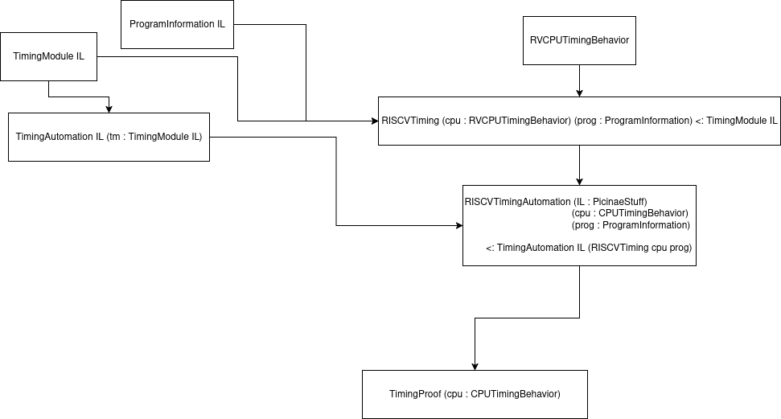

# Timing Paper Outline

## Introduction
**Problem**: Not all WCET analysis provides guarantees, even the ones that do may not be very precise. WCET analysis cannot discover timing attack vulnerabilities

**Goal**: be able to formally prove the timing behavior of a program, namely its responsiveness or immunity to timing attacks

**Contributions**:

- Picinae Timing Module - Generic extension to the Picinae binary verification system for trace-based timing verification of binary code
  - RISC-V timing module
  - NEORV32 instantiation of the RISC-V timing module
- Automation
  - `hammer` tactic for solving `cycle_count_of_trace` goals
  - Tactics like `compare_sums` for debugging `cycle_count_of_trace` goals
  - Timing Invariant Generator (TIG) for automatically generating invariant and proof scaffolding
- Examples of timing proofs
  - Data Structures and Algorithms
    - Array: linear search, bubble sort
    - Linked List: linear search, insert at position, WIP insert in sorted list
  - FreeRTOS
    - lists.c: all functions (WIP vInsertList)
    - tasks.c: notably vTaskSwitchContext, some others
    - queue.c: a few functions
  - Cryptography
    - ChaCha20 (handwritten version and MIT PLV version)
    - passwordCheck CVE (vulnerable version and patched safe version)
    - ct-swap (constant-time swap routine from paper)
- Comparisons of proof predictions to real executions
  - DSA proofs

## Overview

### Workflow

### Limitations

### Threat Model

### Model Assumptions

1. Memory Latency
2. CPU Documentation
3. Clock Frequency Variation
4. Interrupts
5. Distributed Execution
6. Out-of-Order Execution
7. Termination
8. Caching

## Technical Overview

We utilize Linear Temporal Logic as the foundation for timing proofs.
Given a function `toi : instruction -> arguments -> N` that defines the time of an instruction given its arguments, we map toi over a program trace to get a list of cycle counts for the instructions in the trace. Summing the list, we get the total number of clock cycles taken by a program from one point of execution to another. This operation is called `cycle_count_of_trace : trace -> N` or `ccot`.

The Picinae system allows users to specify correctness of programs with respect to any trace `t` that begins at a program entry point and ends at a program exit point.
This allows us to verify the timing of a program by reasoning about `ccot t`.
As a result, the primary postcondition of a Picinae timing proof states `ccot t = f(x0 ... xn)` where `t` is any complete program trace for the targeted program, and `x{i}` is a numeric expression optionally parametrized by a CPU state value, typically the state of the program at entry.
A timing postcondition can then be used to predict the exact timing behavior of a program without running it. This allows for:

- the discovery of timing attack vulnerabilities (if x{i} is parametrized by a secret value v, then an attacker can reconstruct v by measuring the execution time of the program)
- construction of tighter real-time systems: because postconditions typically provide equalities, and WCET analysis provides overapproximations of upper bounds, a real-time system with timing guarantees can allot less time between function calls as they don't have to account for an overapproximation

## Example

The PTM is implemented as a hierarchy of modules and module types the describe CPU behavior, program information, lemmas and definitions regarding timing, and proof tactics.
Let's explore the hierarchy starting from the user's point of view (a proof) and tracing the dependencies backwards.
We'll be looking at a timing proof for a simple program that adds two numbers in a loop, which will serve as an example for timing proof style as well.
After walking through the proof at a high level, we'll explore the dependencies.

Every timing proof is a functor. Timing proof functors take in a CPU description as input. That way, you write your proof with no specific knowledge of any one CPU. Then, you can instantiate the proof module with a specific CPU description and get a timing guarantee that is specific to your CPU of choice for free.

When the user begins a timing proof, they will write a standard header section to set up their environment:

```coq
Module Program_addloop <: ProgramInformation.
    Definition entry_addr : N := 0x8.

    Definition exits (t:trace) : bool :=
        match t with (Addr a,_)::_ => match a with
        | 0x20 => true
        | _ => false
    end | _ => false end.

    (* This definition is auto-generated by a lifter script *)
    Definition binary (a : addr) : N :=
        match a with
        | 0x8  => 0x00106393 (* ori     t2,zero,1 *)
        | 0xc  => 0x000e7e13 (* andi	t3,t3,0 *)
        | 0x10 => 0x01c28863 (* beq	t0,t3,20 <end> *)
        | 0x14 => 0x00130313 (* addi	t1,t1,1 *)
        | 0x18 => 0x407282b3 (* sub	t0,t0,t2 *)
        | 0x1c => 0xffce0ae3 (* beq	t3,t3,10 <add> *)
        | _ => 0 
        end.
End Program_addloop.

Module RISCVTiming := RISCVTiming cpu Program_addloop.
Module addloopAuto := RISCVTimingAutomation RISCVTiming.
Import Program_addloop addloopAuto.
```

Let's go through line by line.

- `Module TimingProof (cpu: RVCPUTimingBehavior).`
  Begins the timing proof functor, taking cpu as an input
- `Module Program_addloop <: ProgramInformation.`
  Begin the ProgramInformation module for the target program
- `Definition entry_addr : N := ...`
  Defines the entry address for the program
- `Definition exits (t:trace) : bool := ...`
  Defines the exit addresses for the program
- `Definition binary :=`
  Defines the function that takes an address and returns an encoded RISC-V instruction. Notice that if registers `t0` and `t1` contain values `x` and `y` at entry, this program should loop `x` times - this will be important later!
- `Module RISCVTiming := RISCVTiming cpu Program_addloop.`
  Instantiates the RISCVTiming module for the provided cpu and program, this defines a `time_of_instruction` function and provides definitions designating the time of a specific instruction
- `Module addloopAuto := RISCVTimingAutomation RISCVTiming.`
  Instantiates the RISCVTimingAutomation module for the provided cpu and program, this defines `cycle_count_of_trace` and provides automation tactics and lemmas
- `Import Program_addloop addloopAuto.`
  Imports all of the definitions from the instantiated modules into the context

Now that the context is set up, we need to define our *invariant set*, the set of propositions that describe the program's behavior throughout its execution.

```coq
Definition addloop_timing_invs (x y : N) (t:trace) :=
match t with (Addr a, s) :: t' => match a with
    | 0x8  => Some (s R_T0 = x /\ s R_T1 = y /\
        cycle_count_of_trace t' = 0)
    | 0x10 => Some (s R_T2 = 1 /\ s R_T3 = 0 /\ 
        s R_T0 <= x /\
        cycle_count_of_trace t' = 
            tori + tandi + (x - s R_T0) * (tfbeq + taddi + tsub + ttbeq))
    | 0x20 => Some (cycle_count_of_trace t' = 
            tori + tandi + x * (tfbeq + taddi + tsub + ttbeq) + ttbeq)
    | _ => None end
| _ => None
end.
```

Notice that our invariant set is parametrized by `x` and `y` - the input values to the `addloop` program.
Now let's investigate the invariants:

1. The invariant at address `0x8`, our invariant address, simply tracks important register contents and the fact that no time has passed yet (`cycle_count_of_trace t' = 0`)
2. The invariant at address `0x10` describes the state of the program at the beginning of each loop iteration. Notably, we know that `t0` has not yet surpassed the initial value `x`, and we can see that the time that's passed is equal to `<time of setup instructions> + <# of loop iterations> * <length of loop body>` where `# of loop iterations` is equal to `x - t0` (convince yourself why this is always true)
3. The invariant at address `0x20` is the postcondition, and we can clearly see that the loop is stated to iterate `x` times


In short, we construct timing invariants that describe the intermediate time of a program at certain points during execution.
Sometimes these invariants will need to track propositions regarding program correctness. This can be seen in the invariants regarding the values of register contents, but this is a mild case.

But these are just statements. Let's look at a timing proof now:

```coq
Theorem addloop_timing:
  forall s t s' x' x y
         (* Define the entry point of the function *)
         (ENTRY: startof t (x',s') = (Addr entry_addr,s))
         (MDL: models rvtypctx s)
         (T0: s R_T0 = x)        (* Tie the contents of T0 to x *)
         (T1: s R_T1 = y),       (* Tie the contents of T1 to y *)
  satisfies_all 
    lifted_prog                  (* Lifted code generated by RISCVTiming *)
    (addloop_timing_invs x y)    (* Invariant set *)
    exits                        (* Exit point *)
  ((x',s')::t).
```

This theorem states that all of our invariants are satisfied for all program traces that start at `entry_addr` and end at one of the `exits`.

We'll prove this theorem by proving a few cases:

1. The base case - given the above theorem assumptions, prove the invariant at `0x8`
2. The loop entry case - given invariant `0x8` as an assumption, prove the invariant at `0x10`
3. The loop exit case - given invariant `0x10` as an assumption, prove the postcondition at `0x20`
4. The loop iteration case - given invariant `0x8` as an assumption, prove that the invariant at `0x8` holds after any one loop iteration

For this proof, the majority of the work here is done by the `hammer` tactic, which seeks to prove goals of the form `cycle_count_of_trace t = ...`.
The rest of the work is done by `lia`, Rocq's built-in `L`inear `I`nteger `A`rithmetic solver, and `psimpl`, the Picinae simplification tactic.

Here's the proof in its entirety:

```coq
Proof.
    intros.
    apply prove_invs.
    Local Ltac step := tstep r5_step.

    (* Case 1 *)
    simpl. rewrite ENTRY. step.
    split.
        assumption.
    split.
        assumption.
    hammer.

    (* Boilerplate *)
    intros.
    eapply startof_prefix in ENTRY; try eassumption.
    eapply preservation_exec_prog in MDL; try (eassumption || apply lift_riscv_welltyped).
    clear - PRE MDL. rename t1 into t. rename s1 into s'.
    destruct_inv 32 PRE.

    (* Case 2 *)
    destruct PRE as [T0 [T2 Cycles]].
    repeat step. repeat split; try assumption. lia. 
    hammer.

    (* Addr 0x10 *)
    destruct PRE as [T2 [T3 [T0 Cycles_t]]].
    step.
    - (* Case 3: t0 = 0 -> postcondition *)
        hammer.
    - (* Case 4: t0 <> 0 -> loop again *)
        step. step. step.
        rewrite msub_nowrap by (psimpl; lia).
        repeat split.
            lia.
        hammer. rewrite N_sub_distr; lia.
Qed.
```

Finally, close the timing proof module:

```coq
End TimingProof.
```

And that's it!

## System Design

Now let's look at the module hierarchy:



The image above shows three clusters of nodes:

1. ISA-agnostic components (top-left)
2. ISA-specific components (top right except `RVCPUTimingBehavior`)
3. Timing Proof

We've already covered the TimingProof modules in our example, so let's trace our steps backwards through the RISC-V specific modules to the ISA-agnostic components

### ISA-specific components

The components we're interested in here are `RISCVTiming`, `RISCVCPUTimingBehavior`, and `RISCVTimingAutomation`.

#### `RISCVTiming`

`RISCVTiming` is the module that defines the `time_of_instr` function. Actually, it specifies a `time_of_addr` function, where the argument is a program address. The instruction binary at that address is fetched, disassembled, and then mapped to an instruction time:

```coq
Definition time_of_addr (s : store) (a : addr) : N :=
        match rv_decode (binary a) with
        (* ==== I ISA Extension ==== *)
        (* ALU *)
        | R5_Add  _ _ _     => tadd
        | R5_Addi _ _ _     => taddi
        | R5_Slt  _ _ _     => tslt
        | R5_Slti _ _ _     => tslti
        | R5_Sltu _ _ _     => tsltu
        | R5_Sltiu _ _ _    => tsltiu
        (* ... *)
        (* Branches *)
        | R5_Beq rs1 rs2 off => bop s time_inf rs1 rs2
            (fun x y => if x =? y then ttbeq else tfbeq)
        | R5_Bne rs1 rs2 off => bop s time_inf rs1 rs2
            (fun x y => if negb (x =? y) then ttbne else tfbne)
        | R5_Blt rs1 rs2 off => bop s time_inf rs1 rs2
            (fun x y => if Z.ltb (toZ 32 x) (toZ 32 y) then ttblt else tfblt)
        | R5_Bge rs1 rs2 off => bop s time_inf rs1 rs2
            (fun x y => if Z.geb (toZ 32 x) (toZ 32 y) then ttbge else tfbge)
        | R5_Bltu rs1 rs2 off => bop s time_inf rs1 rs2
            (fun x y => if x <? y then ttbltu else tfbltu)
        | R5_Bgeu rs1 rs2 off => bop s time_inf rs1 rs2
            (fun x y => if negb (x <? y) then ttbgeu else tfbgeu)
        (* ... *)
```

Additionally, this module lifts the binary defined in a `ProgramInformation` module passed in as input:

```coq
Definition lifted_prog := lift_riscv binary.
```

#### `RISCVCPUTimingBehavior`

These definitions provided by `RISCVTiming` result in a clear separation between the ISA and specific CPUs that are implemented in `RVCPUTimingBehavior`. Let's look at what that module type provides:

```coq
Module Type RVCPUTimingBehavior.
    (* === Instruction Timings === *)
    Parameter
        (* ==== I ISA Extension ==== *)
        (* ALU *)
            tadd taddi tslt tslti tsltu tsltiu
            txor txori tor tori tand tandi tsub tlui
            tauipc
        (* Branches *)
            (* taken *)
                ttbeq ttbne ttblt ttbge ttbltu ttbgeu
            (* not taken *)
                tfbeq tfbne tfblt tfbge tfbltu tfbgeu
        (* Jump/call *)
            tjal tjalr
        (* Load/store *)
            tlb tlh tlw tlbu tlhu tsb tsh tsw
        (* Data fence *)
            tfence
        (* System *)
            tecall tebreak tmret twfi
        (* ... *)
```

This module type defines identifiers that represent the times of each ISA instruction.
Let's look at an implementation of this module for a specific CPU, NEORV32:

```coq
Module Type NEORV32Config.
    (* The clock frequency of the processor’s clk_i input port in Hertz *)
    Parameter CLOCK_FREQUENCY : N.
    (* Implement fast but large full-parallel barrel shifters *)
    Parameter CPU_FAST_SHIFT_EN : bool.
    (* Implement fast but large full-parallel multipliers *)
    Parameter CPU_FAST_MUL_EN : bool.
    (* Implement the instruction cache *)
    Parameter ICACHE_EN : bool.
    (* Implement the data cache *)
    Parameter DCACHE_EN : bool.
End NEORV32Config.

(* https://stnolting.github.io/neorv32/#_instruction_sets_and_extensions *)
Module NEORV32 (cfg : NEORV32Config) <: RVCPUTimingBehavior.
    (* Latency Definitions *)
    Definition T_shift_latency (offset : N) : N :=
        if cfg.CPU_FAST_SHIFT_EN then
            1
        else
            offset.

    Definition T_mul_latency : N :=
        if cfg.CPU_FAST_MUL_EN then
            1
        else
            32.

    Parameter T_data_latency : N.
    Parameter T_inst_latency : N.

    (* ==== I ISA Extension ==== *)
    (* ALU *)
    Definition tadd := 2.
    Definition taddi := 2.
    Definition tslt := 2.
    Definition tslti := 2.
    Definition tsltu := 2.
    Definition tsltiu := 2.
    (* ... *)
    Definition tsll (offset : N) := 
        3 + T_shift_latency offset.
    (* ... *)
    Definition ttbeq := 5 + T_inst_latency.
    (* ... *)
```

`NEORV32` gives concrete definitions to the identifiers required by `RVCPUTimingBehavior`. It can do so however it chooses, such as assuming values for memory latency which it can parametrize instruction timings by, or by requiring a CPU configuration module as input for highly-configurable CPUs.

#### `RISCVTimingAutomation`

With all of this, we can instantiate the `RISCVTimingAutomation` module. `RISCVTimingAutomation` implements the ISA-agnostic `TimingAutomation` module type, preventing custom proof tactics and definitions for RISC-V and a specific CPU such as NEORV32.

We've seen one of these tactics already - the powerful `hammer`! It's using custom simplification and reduction rules automatically generated by the module hierarchy!

### ISA-agnostic components

Finally, let's look at the ISA-agnostic components. One of them is `ProgramInformation`, which we've already seen in the above example.

#### `TimingModule`

This is a very tiny module type:

```coq
Module Type TimingModule (il : PICINAE_IL).
    Export il.
    Export Lia.

    Parameter time_of_addr : store -> addr -> N.
    Parameter time_inf : N.
End TimingModule.
```

Remember, `RISCVTiming` implements this module type.
We can see that this module requires the definition of `time_of_addr`, but something that sticks out is `time_inf`.
This is a sentry value that is placed in a goal whenever a problem occurs. We'll see how in the next section.

#### `TimingAutomation`

```coq
Module TimingAutomation (IL : PICINAE_IL) (THEORY : PICINAE_THEORY IL)
    (STATICS: PICINAE_STATICS IL THEORY)
    (FINTERP: PICINAE_FINTERP IL THEORY STATICS) (SIMPL : PICINAE_SIMPLIFIER_V1_1 IL THEORY STATICS FINTERP)
    (tm : TimingModule IL).

Export IL.
Export SIMPL.
Export THEORY.
Export STATICS.
Export FINTERP.
Module PSB := Picinae_Simplifier_Base IL.
Export PSB.
Module ISA_RISCV := Picinae_ISA IL SIMPL THEORY STATICS FINTERP.
Export ISA_RISCV.
Export tm.

Ltac PSimplifier ::= SIMPL.PSimplifier.

Definition cycle_count_of_trace (t : trace) : N :=
    List.fold_left N.add (List.map 
        (fun '(e, s) => match e with 
            | Addr a => time_of_addr s a
            | Raise n => time_inf
            end) t) 0.

Ltac hammer := ...
Ltac compare_sums := ...
```

1. This module takes in Picinae ISA semantics modules and a `TimingModule`.
2. It then instantiates and exports the Picinae simplifier and an all-together Picinae ISA module.
3. It defines `cycle_count_of_trace` using values from the `TimingModule`
4. It defines helpful tactics like `hammer` and `compare_sums`

Remember, `RISCVTimingAutomation` is a special case of this module!

### Hierarchy Summary

And there you have it. Some components for operations that don't require any ISA/CPU information. Some components for operations specific to an ISA. And components specific to a certain CPU and program.
For your convenience, here's the same diagram from above:


## Real-World Examples

How well does the PTM fare against real-world code? We saw a naive, handwritten addition loop, but there is some monster binary code out there, hyper-optimized by compilers. Let's evaluate the PTM with some timing proofs that were written with it. We break the evaluation proofs into three sections:

1. Generic Data Structures & Algorithms
2. FreeRTOS
3. Cryptography

### DSA

#### Arrays

1. Linear Search

```coq
Definition time_of_find_in_array (len : N) (found_idx : option N) (t : trace) :=
    cycle_count_of_trace t =
        (* setup time *)
        taddi +
        (* loop iterations *)
        (match found_idx with None => len | Some i => i end) *
        (* loop body duration *)
        (tfbgeu + tslli 2 + tadd + tlw + tfbeq + taddi + tjal) +
        (* partial loop iteration before loop exit *)
        (match found_idx with 
         | None => ttbgeu
         | Some _ => tfbgeu + tslli 2 + tadd + tlw + ttbeq
         end) +
        (* shutdown time *)
        taddi + tjalr.
```

Timing is parametrized by array length if key not found, or `idx` if key found at position `idx`.
Here's the postcondition for a heavily-optimized version:

```coq
Definition time_of_find_in_array_opt (len : N) (found_idx : option N) (t : trace) :=
    cycle_count_of_trace t =
        if len =? 0 then (
            ttbeq + taddi + tjalr
        ) else (
            (* setup *)
            tfbeq + taddi + tjal + tlw + taddi +
            (* arr[0] check *)
            if (match found_idx with Some 0 => true | _ => false end) then (
                tfbne + taddi + taddi + tjalr
            ) else (
                ttbne +
                (* loop iterations *)
                (match found_idx with None => len - 1 | Some i => i - 1 end) *
                (* loop body duration *)
                (taddi + tfbeq + tlw + taddi + ttbne) +
                (* partial loop iteration before loop exit *)
                (match found_idx with
                 | None => taddi + ttbeq
                 | Some _ => taddi + tfbeq + tlw + taddi + tfbne + taddi
                 end) +
                (* return *)
                taddi + tjalr
            )
        ).
```

2. Bubble Sort

```coq
Definition time_of_bubble_sort_theta_n2 (len : N) (t : trace) :=
    (* ----------------------------------------- *)
    (* lower bound *)
    tslli 2 + tadd + taddi +
    (* outer loop full iterations *)
    len * (
        tfbeq + taddi + tjal +
        (* inner loop full iterations *)
        (len - 1) * (
            ttbne +
            tlw + tlw +
            (* branch timing depends on instruction latency, 
               which is dependent on memory speed, so we can't know
               whether the time of a successful branch to skip the
               if-then body will be faster or slower than 
               falling through + the if-then body
            *)
            N.min ttbgeu (tfbgeu + tsw + tsw) +
            taddi
        ) +
        (* inner loop partial iteration *)
        tfbne +
        taddi + tjal
    ) +
    (* outer loop partial iteration *)
    ttbeq +
    (* return *)
    tjalr <=
    (* ----------------------------------------- *)
    cycle_count_of_trace t <=
    (* ----------------------------------------- *)
    (* upper bound *)
    tslli 2 + tadd + taddi +
    (* outer loop full iterations *)
    len * (
        tfbeq + taddi + tjal +
        (* inner loop full iterations *)
        (len - 1) * (
            ttbne +
            tlw + tlw +
            N.max ttbgeu (tfbgeu + tsw + tsw) +
            taddi
        ) +
        (* inner loop partial iteration *)
        tfbne +
        taddi + tjal
    ) +
    (* outer loop partial iteration *)
    ttbeq +
    (* return *)
    tjalr.
```

This is actually a proof of upper and lower bounds! We're working on an exact timing behavior proof but the conditional swap in the inner loop of bubble sort makes any proof of behavior for this function very difficult.

#### Linked Lists

The linked list proofs required the development of formalizations for linked lists that Picinae had not previously contained. Super useful.

1. Linear Search

```coq
Definition time_of_find_in_linked_list
        (len : nat) (found_idx : option nat) (t : trace) :=
    cycle_count_of_trace t =
        match found_idx with
        | None =>
            N.of_nat len
        | Some idx =>
            N.of_nat idx
        end * (
          tfbeq + tlw + tfbeq + tlw + tjal
        ) + (match found_idx with
            | None =>
              ttbeq
            | Some _ =>
              tfbeq + tlw + ttbeq
            end) + tjalr.
```

Similar to array search timing.

2. Insert at Position

```coq
Definition time_of_insert_after_pos_in_list 
    (l value : addr) (position len : N) (t : trace) :=
  cycle_count_of_trace t =
    if (l =? NULL) then (
      ttbeq + tjalr
    ) else (
      tfbeq + taddi + 
      if (value =? NULL) then (
        tfbne + tjalr
      ) else (
        ttbne + tlw + if (position =? 0) then (
          tfbne + tsw + tsw + tjalr
        ) else (
          ttbne + (if (position <? len) then (
            (position - 1) * (
                tfbeq + taddi + taddi + tlw + ttbne
            ) + tfbeq + taddi + taddi + tlw + tfbne
          ) else (
            (len - 1) * (
                tfbeq + taddi + taddi + tlw + ttbne
            ) + ttbeq
          )) + tsw + tsw + tjalr
        )
      )
    ).
```

### FreeRTOS

The following proofs are all responsiveness. As such, I won't go into detail. Just know their exact timing behaviors have been proven.

#### `tasks.c`

1. `vTaskSwitchContext`
2. `prvResetNextTaskUnblockTime`
3. `vTaskSuspendAll`
4. `xTaskGetCurrentTaskHandle`

#### `list.c`

1. `uxListRemove`
2. `vListInitialise`
3. `vListInitialiseItem`
4. `vListInsertEnd`

#### `queue.c`

1. `xQueueGetMutexHolderFromISR`
2. `xQueueGetMutexHolder`
3. `xQueueMessagesWaiting`
4. `uxQueueSpacesAvailable`

### Cryptography

#### ChaCha20

```coq
Definition time_of_chacha20_block (t : trace) : Prop :=
  cycle_count_of_trace t = taddi + 13 * tsw + 4 * taddi +
      4 * (tsw + tlui + taddi) + 
      8 * (tsw + taddi + 4 * tlbu + 4 * tsb + tlw) +
      tsw + 4 * tlbu + 4 * tsb + tlw + 
      2 * (taddi + 4 * tlbu + 4 * tsb + tlw) +
      4 * taddi + 10 * tsw + taddi + tsw + tsw +
      10 * (4 * taddi + 3 * tlw + tjal +
        time_of_chacha20_quarter +
        5 * taddi + 3 * tlw + tjal +
        time_of_chacha20_quarter +
        tsw + 6 * taddi + 3 * tlw + tjal +
        time_of_chacha20_quarter +
        8 * taddi + 3 * tlw + tjal +
        time_of_chacha20_quarter +
        4 * taddi + 3 * tlw + tjal +
        time_of_chacha20_quarter +
        5 * taddi + 3 * tlw + tjal +
        time_of_chacha20_quarter +
        4 * taddi + 4 * tlw + tjal +
        time_of_chacha20_quarter +
        5 * taddi + 3 * tlw + tjal +
        time_of_chacha20_quarter + 
        taddi + taddi) + 9 * ttbne + tfbne +
    172 * tsb + 108 * tlbu + 65 * tlw +
    16 * (tsrli 0x8 + tsrli 0x10 + tsrli 0x18) +
    16 * tadd + 16 * txor + 7 * taddi + 
    4 * tlui + tjalr.
```

We initially had a ChaCha20 proof that was written in 2 months by 4 first-year graduate students who had only ~8 hours of instruction on Picinae.
The implementation they verified was hand-written.
The above postcondition is from a proof for a [version of ChaCha20](https://github.com/mit-plv/bedrock2/blob/84cfff9b9d1ab923f0570833476047b3a040768b/bedrock2/src/bedrock2Examples/chacha20.v) that was [formally verified](https://github.com/mit-plv/fiat-crypto/blob/d24de1638e5b7659000cd1faf3875b6ea4597811/src/Bedrock/End2End/RupicolaCrypto/ChaCha20.v) by a team at MIT.

#### [CVE-2014-0984](https://www.cvedetails.com/cve/CVE-2014-0984/)

This CVE describes the vulnerability of a password checker routine to timing side-channel attacks.
This is because it leaks the index of the first character in the user-provided password that is different from the correct password.

We show that the initial version leaks this information, and we show that a patched version only leaks the length of the user-provided password (which an attacker would already know):

```coq
Definition time_of_passwordCheck (stored_len : N) (diff_idx : option N) (t : trace) :=
    cycle_count_of_trace t =
        (match diff_idx with None => stored_len | Some idx => idx end) *
        (tlbu + tlbu + ttbeq + taddi + taddi + ttbne) +
        match diff_idx with
        | None => tlbu + tlbu + ttbeq +
            taddi + taddi + tfbne +
            taddi + tjalr
        | Some _ => tlbu + tlbu + tfbeq + 
                    tsltiu + tsub + tandi + taddi + tjalr
        end.

Definition time_of_passwordCheck_safe (len_user : N) (t : trace) :=
    cycle_count_of_trace t =
        taddi +
        len_user * (
            tlbu + tlbu + tsub + tsltiu + tsltiu +
            tor + tand + taddi + tsltu + tadd + ttbne
        ) + tlbu + tlbu + tsub + tsltiu + tsltiu +
            tor + tand + taddi + tsltu + tadd + tfbne +
        taddi + tandi + tjalr.
```

#### `ct-swap`

This is a function that was proposed in a writeup on microarchitectural timing attacks for modern Apple CPUs: https://gofetch.fail/files/gofetch.pdf. We can see that it's only parametrized by the input array's length, considered not secret.

```coq
Definition time_of_ct_swap (len : N) (t : trace) :=
    cycle_count_of_trace t = 
    (* Function entry *)
    tslli 2 + tsub + tadd + 
    (* loop *)
    len *
    ((ttbne + tlw + tlw + taddi + taddi + txor + tand + txor + tsw + tlw + txor + tsw + tjal)) +
    (* loop exit and function return *)
    tfbne + tjalr.
```
